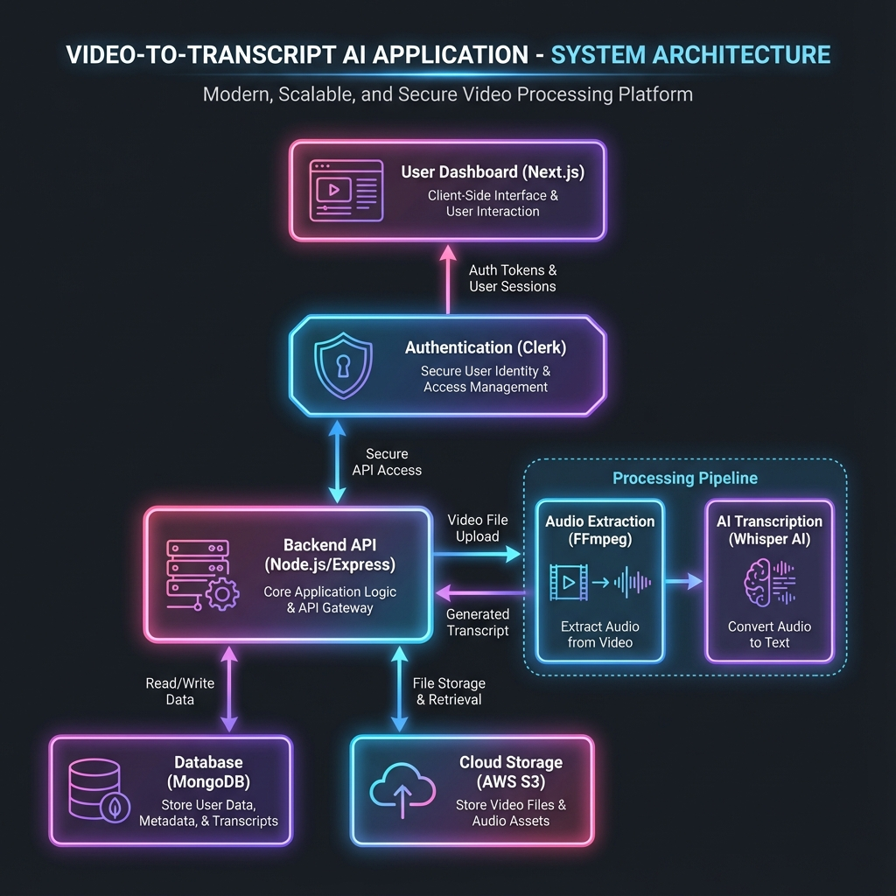

# System Architecture - Clueso Clone

This document provides a high-level overview of the system architecture, component relationships, and the step-by-step process of the video-to-transcript pipeline.

## 1. High-Level Diagram

## 2. Core Components

### Frontend (Next.js)
- **User Interface**: A modern, responsive dashboard built with **React** and **Tailwind CSS**.
- **State Management**: Real-time UI updates using React Hooks and Context API for project synchronization.
- **Client Auth**: Integrated with **Clerk** for secure user sessions and JWT-based API protection.
- **Media Experience**: Custom video canvas and interactive timeline for script editing.

### Backend (Node.js/Express)
- **API Gateway**: Provides authenticated endpoints for project management, job tracking, and AI rewrites.
- **Job Orchestrator**: Manages the lifecycle of transcription jobs, updating states in the database.
- **Authentication**: Backend middleware validated by **Clerk** to ensure data isolation between users.
- **Shared Schema**: Uses a shared library for consistent data models across services.

### Infrastructure & Storage
- **Database (MongoDB)**: Stores project metadata, user settings, and job logs using **Mongoose**.
- **Cloud Storage (AWS S3)**: Securely stores raw video uploads, extracted audio, and generated transcript JSON files.

### Processing Pipeline (AI & Media)
- **Audio Extraction**: Leverages **FFmpeg** to isolate audio streams from uploaded video files.
- **AI Transcription**: Uses **OpenAI Whisper (Python)** for high-accuracy speech-to-text.
- **Optimization Layer**: Implements **FFmpeg Silence Trimming** and optimized Whisper model configs (Tiny/Base) to achieve sub-60s transcription speeds.

## 3. The End-to-End Process

The following workflow describes the journey from a raw video to a polished transcript:

1.  **Authentication**: The user logs in via Clerk. All subsequent requests include a secure Bearer token.
2.  **Upload**: The user uploads a video. The Frontend sends the file to the Backend, which stores it in **AWS S3** and initializes a `Project` record in **MongoDB**.
3.  **Job Initiation**: A `CluesoJob` is created with an initial status of `UPLOADED`. 
4.  **Media Processing**:
    *   **Extraction**: The system runs an **FFmpeg** worker to extract the audio from the video.
    *   **Pre-processing**: Silence is trimmed from the audio to optimize AI inference speed.
5.  **Transcription**: The **Whisper AI** Python script is triggered. It detects the language, transcribes the audio, and outputs the raw text.
6.  **Persistence**: The Backend uploads the transcript (JSON) to S3 and updates the `Project` text in MongoDB. The job state moves to `TRANSCRIBED`.
7.  **Finalization**: The Frontend, which has been polling the status, detects the completion and immediately fetches the transcript for display in the editor.

---
