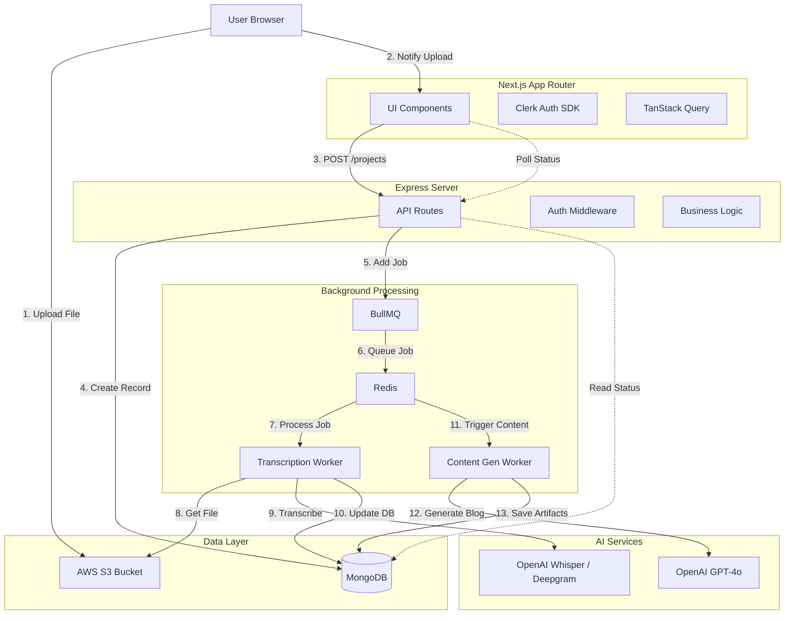

# Clueso.io Clone - System Architecture

This document defines the complete system architecture for the Clueso.io clone MVP. The system is designed for scalability, reliability, and clear separation of concerns, specifically determining how long-running AI tasks are handled.

## 1. System Overview Diagram



## 2. Component Responsibilities

### A. Frontend (Next.js Application)
*   **Framework**: Next.js 14+ (App Router).
*   **Responsibility**:
    *   **User Interface**: Dashboard, Upload Area, Project Details, Editor.
    *   **Authentication**: Handling Clerk sessions and protecting routes.
    *   **Direct Uploads**: Requesting Presigned URLs from Backend and uploading files directly to AWS S3 (bypassing the backend server to save bandwidth).
    *   **State Management**: Polling backend for project status (`queued` -> `processing` -> `completed`) using React Query / SWR.
    *   **Display**: Rendering Markdown/Rich Text for generated blogs and tweets.

### B. Backend API (Node.js + Express)
*   **Framework**: Express.js with TypeScript.
*   **Responsibility**:
    *   **Resource Management**: CRUD operations for Projects, Transcripts, and Content.
    *   **Signer**: Generating AWS S3 Presigned URLs for secure client-side uploads.
    *   **Producer**: Validating requests and adding jobs to `BullMQ` queues.
    *   **Webhooks**: Handling payment or external webhooks (if applicable).
    *   **Security**: Validating JWTs from Clerk/Frontend.

### C. Background Job Flow (BullMQ + Redis)
Async processing is critical to prevent timeouts during long AI operations.

1.  **Queue 1: `transcription-queue`**
    *   **Trigger**: File upload confirmed.
    *   **Task**: Download audio from S3 -> Send to Whisper -> Format response -> Save Transcript to DB.
    *   **Next Step**: Automatically trigger `content-generation-queue`.

2.  **Queue 2: `content-generation-queue`**
    *   **Trigger**: Transcription completion.
    *   **Task**: Read Transcript -> Send prompt to GPT-4o -> Parse JSON response -> Save Blog/Social Content to DB.

## 3. Detailed Data Flow

### Phase 1: Upload & Ingestion
1.  **User** drops a file in Frontend.
2.  **Frontend** requests a Presigned Put URL from `POST /api/upload/presigned`.
3.  **Backend** generates URL via AWS SDK and returns it.
4.  **Frontend** uploads file directly to S3.
5.  **Frontend** calls `POST /api/projects` with `s3Key`, `filename`, `duration`, etc.
6.  **Backend** creates `Project` in MongoDB with status `UPLOADED`.
7.  **Backend** adds job to `transcription-queue` and returns `201 Created`.

### Phase 2: Transcription (Async)
1.  **Transcription Worker** picks up job.
2.  **Worker** updates Project status to `TRANSCRIBING`.
3.  **Worker** downloads file (stream) or generates S3 Presigned Get URL for the AI service.
4.  **Worker** sends audio to **Whisper API**.
5.  **Worker** receives text + timestamps.
6.  **Worker** saves `Transcript` document linked to `Project`.
7.  **Worker** updates Project status to `TRANSCRIBED`.
8.  **Worker** adds job to `content-generation-queue`.

### Phase 3: Content Generation (Async)
1.  **Content Worker** picks up job.
2.  **Worker** updates Project status to `GENERATING`.
3.  **Worker** fetches `Transcript` from DB.
4.  **Worker** constructs prompt (System Prompt + Transcript).
5.  **Worker** sends to **GPT-4o**.
6.  **Worker** receives Blog Post, Twitter Thread, LinkedIn Post.
7.  **Worker** saves `ContentArtifacts` in DB.
8.  **Worker** updates Project status to `COMPLETED`.

## 4. Database Schema Interaction (MongoDB)

**Project**
```typescript
{
  _id: ObjectId,
  userId: string, // Clerk User ID
  title: string,
  status: 'UPLOADED' | 'TRANSCRIBING' | 'TRANSCRIBED' | 'GENERATING' | 'COMPLETED' | 'FAILED',
  s3Key: string,
  createdAt: Date
}
```

**Transcript**
```typescript
{
  _id: ObjectId,
  projectId: ObjectId,
  fullText: string,
  segments: [
    { start: number, end: number, text: string, speaker: string }
  ]
}
```

**ContentArtifact**
```typescript
{
  _id: ObjectId,
  projectId: ObjectId,
  type: 'BLOG_POST' | 'TWITTER_THREAD' | 'LINKEDIN_POST',
  content: string, // Markdown or HTML
  metadata: { ... } // SEO tags, hashtags
}
```

## 5. Failure & Retry Strategy

### Application Level
*   **BullMQ Retries**: Configure jobs with `{ attempts: 3, backoff: { type: 'exponential', delay: 1000 } }`.
*   **Graceful Handling**: If a worker fails after retries, it moves to `Global Failed` handler.
    *   Update `Project` status to `FAILED`.
    *   Save error message in `Project.error`.
    *   Frontend displays "Processing Failed" with a "Retry" button.

### Infrastructure Level
*   **Redis Persistence**: Ensure AOF (Append Only File) is enabled in Redis so jobs aren't lost on restart.
*   **Timeouts**: Set strict timeouts for AI API calls (e.g., 10 mins) to prevent hung workers.

## 6. Project Lifecycle Step-by-Step

1.  **User Login**: Authenticate via Clerk.
2.  **Dashboard Load**: Fetch `GET /api/projects`.
3.  **Upload**: User uploads `interview.mp4`.
4.  **Processing**:
    *   Server acknowledges upload.
    *   User sees "Processing... (Step 1/2: Transcribing)" on UI.
    *   User sees "Processing... (Step 2/2: Generating Content)".
5.  **Completion**:
    *   UI Polling receives `status: COMPLETED`.
    *   User is redirected to Project Detail page.
6.  **Review**: User edits the generated Blog Post in the editor.
7.  **Export**: User copies content to clipboard.
